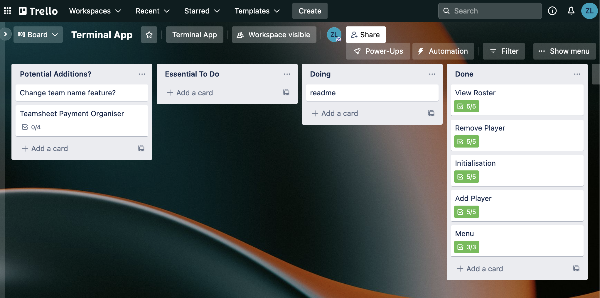

# TEAM MANAGER ASSISTANT
The Team Manager Assistant is a simple tool that helps store vital team related information for any casual sports team. It tracks information such as name, jersey number and phone number in a single CSV file.  
  
The data is stored and can be retrieved at a later date, allowing users to append the team roster if players join or leave the team.  

---
## [Github Repo](https://github.com/ZacharyHLong/terminal_app)  
---
## Style Guide
This project is adhering to the PEP 8 - Style Guide  
### [PEP 8](https://peps.python.org/pep-0008/)
---
## Features
The Team Manager Assistant is composed of several key features that work in conjunction to help users store and manage their team information. The following features comprise the Team Manager Assistant:
### **View Roster**
The View Roster feature allows user's to view the team information they have input. This feature contains some simple loops and conditional control structures to determine if information has been input.  

- If no players have been added, users will be unable to view the roster.
- If players have been added, users will then be directed to a formatted table of the players information.

### **Add Player**
The Add Player feature allows users to input information for each player they want to add. This feature is comprised of several sophisticated conditional control statements and loops.  

The Add Player feature asks for input relating to the players first and last name, along with their jersey number and phone number. As part of this feature, only valid inputs are accepted.

- First and Last Name inputs will only accept alphabetic characters (title casing is applied regardless of if the user used correct name casing).
- Jersey Number will only accept numeric characters that are either 1 or 2 digits (e.g. 5 or 24).
- Phone Number will only accept numeric characters that are either 8 or 10 digits (standard length of phone numbers within Australia)

If incorrect inputs are provided, several error handling functions are used to ensure that user's are directed to correctly input valid values.

Once the correct values have been provided the player is then added to the 'roster.csv' file contained within the source directory. The user is then prompted to add another player if desired.

### **Remove Player**
The Remove Player feature allows users to remove a player from the roster. It involves serval conditional control structures and loops, to ensure that players are removed successfully.  

Users are shown the team roster, and are then prompted for a first name of the player they would like to remove. If the input does not match an existing first name on the roster, or if the input is not alphabetical, error handling will occur.

Once a valid first name has been entered, the user will be warned that removing the player from the roster cannot be undone, then prompts the user for confirmation. If accepted, the program will then remove the player from the corresponsing CSV file.

### **Menu**
The Menu feature provides users with a simple menu listing the above features, along with a quit item. Each menu item has a corresponsing number that the user can select to access their desired feature.  

---
## Implementation Plan
Trello was used to manage the development of the Team Manager Assistant. There were a few issues in following time commitments/expectations as several personal issues made time management rather difficult. Below is the link to the Trello board.
### [Trello Board](https://trello.com/b/vo7p8LTM/terminal-app)

----
